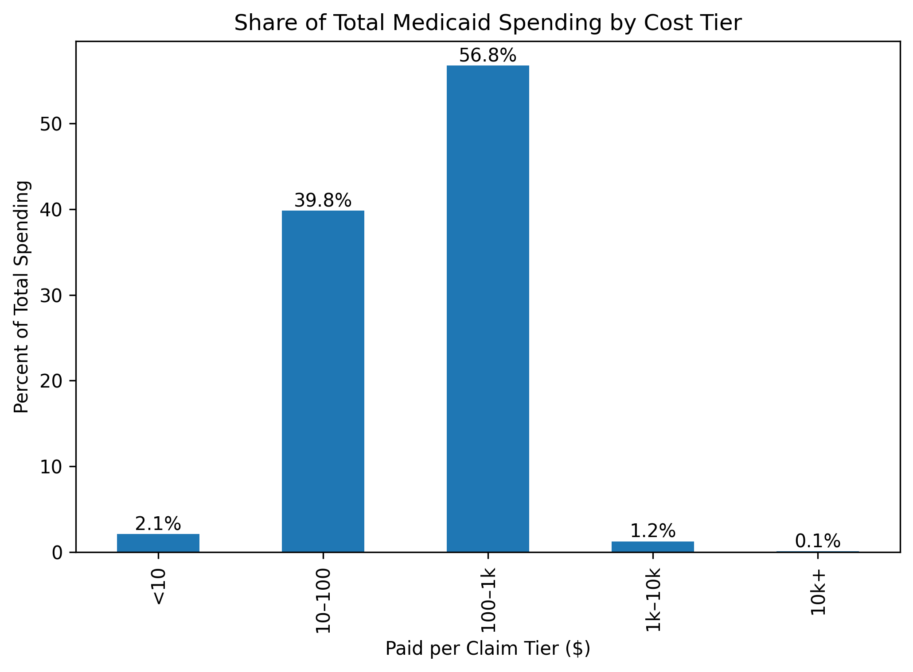

## Observations: Distribution of Paid per Claim

To understand how Medicaid spending varies across different services, we calculated the **average paid amount per claim for each HCPCS code** across all providers and all months (2018–2024).

This allows us to compare the relative cost of services independent of volume.

### Key Observation: Highly Right-Skewed Cost Distribution

The distribution of average paid per claim is **extremely right-skewed**:

- The vast majority of HCPCS codes have a **low average reimbursement per claim**
- A small number of HCPCS codes have **very high reimbursement per claim**
- These high-cost procedures form a long right tail in the distribution

This pattern indicates that:

> Most Medicaid-covered services are low-cost, while a small subset of services are extremely expensive on a per-claim basis.

### Minimum Volume Filter

To avoid misleading results from low-volume procedures, we excluded HCPCS codes with fewer than **10,000 total claims** across the dataset.  
This ensures that the observed outliers represent consistently high-cost services rather than rare or anomalous billing.

### Distribution of Average Paid per Claim

### Interpretation

From the chart we can see:

- A dense concentration of procedures at the low-cost end
- A rapid drop-off as cost increases
- A small number of procedures extending far beyond the typical range

This confirms that:

- A small number of procedures are responsible for **disproportionately high per-claim costs**