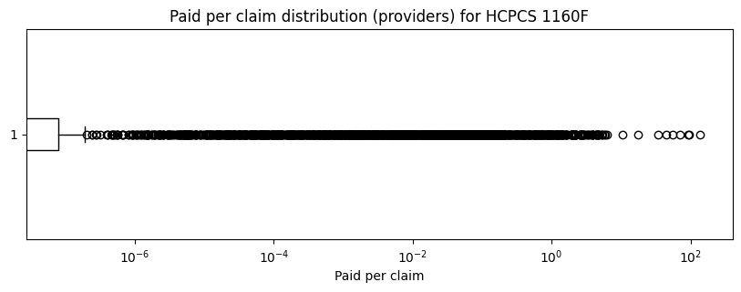

## Observations: Provider Outliers Within Each Procedure (Paid per Claim)

To understand whether individual providers are charging unusually high amounts for the *same* service, we calculated **paid per claim** for each combination of:

- **HCPCS code**
- **Billing provider (NPI)**

Because the dataset is aggregated at **Provider × HCPCS × Month** (2018–2024), we first summed payments and claims across all months for each provider–procedure pair, then computed:

> **paid_per_claim = total_paid / total_claims**

This allows us to compare providers **within the same procedure** and identify providers whose average reimbursement per claim is unusually high relative to peers.

### Key Observation: Most Providers Cluster Tightly, With a Small Number of Extreme Outliers

For many HCPCS codes, the distribution of paid per claim across providers shows:

- A tight cluster of providers with similar reimbursement levels
- A long upper tail of providers with higher-than-typical reimbursement per claim
- A small number of providers that are extreme outliers compared to peers

This pattern indicates that:

> For certain procedures, reimbursement per claim is relatively consistent across providers, but a small number of providers receive substantially higher payments per claim than the rest.

### Outlier Detection Method

We used the **Interquartile Range (IQR)** rule to identify high outliers for each HCPCS code:

- **Q1** (25th percentile) and **Q3** (75th percentile) are computed across providers’ paid per claim values
- **IQR = Q3 − Q1**
- A provider is flagged as a high outlier if:

> **paid_per_claim > Q3 + 1.5 × IQR**

Outliers are displayed as points beyond the whiskers in box plots.

### Example Box Plot: Provider Paid per Claim for a Single HCPCS

### Interpretation

From the box plots we can see:

- The **box** represents the middle 50% of providers (Q1 to Q3)
- The **median line** is the typical provider paid per claim for the procedure
- The **whiskers** represent the expected range of non-outlier providers
- The **dots beyond the whiskers** are providers flagged as statistical outliers

This confirms that:

- Outlier providers can be identified **within the same HCPCS code**, enabling targeted investigation by procedure
- Some procedures exhibit **high concentration of providers near a norm**, with a few providers far above that norm